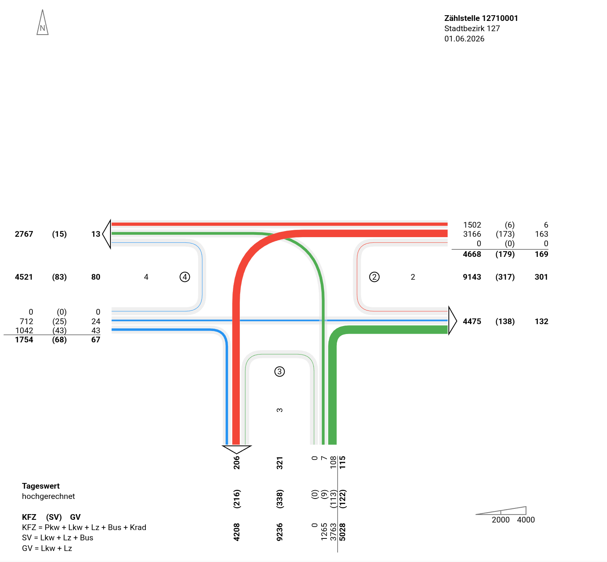
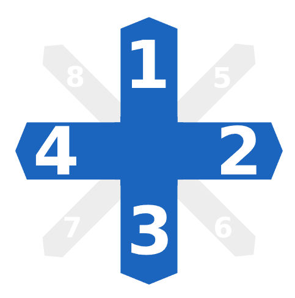

# Adapter to send Telraam sensor data to DAVe
[DAVe](https://starwit-technologies.de/products/dave-open-source-traffic-count-analysis-for-modern-mobility-management/) is a software to analyse and visualize traffic data. Data is collected by a large number of sensors. This repository shall provide code, to transfer data from sensor offered by [Telraam](https://telraam.net/). See their web page, if you want to know more about their hardware.

## Mission Goal
This software shall read data from Telraam's sensor network and convert counting data such, that DAVe can create node stream diagrams. Diagrams look like so:


### Target Features
* Auto detect all sensors in a geo-fenced region
* Check if for every sensor a counting spot in DAVe exists
* Auto Detect traffic direction (north, south,...)
* Transfer count data every 15 minutes

## Traffic Data Background
This section provides all info, to understand how to transfer data to DAVe and how to extract them from Telraam.

### Data Model in DAVe
In [DAVe](https://opensource.muenchen.de/de/software/dave.html) directions are defined as shown in the following image. Top side is pointing north. Following image shows an example for a configured intersection counting.



All collected data needs to be brought into this format.

### Telraam Sensor Doc
Data for Telraam sensors can be accessed via a centralized API. See [API Definition](https://app.swaggerhub.com/apis-docs/telraam/Telraam-API/1.2.0) for more details. There are also some [examples](doc/telraam.md) how to query this API.

## Technical Architecture
Application is implemented using Spring Boot. Core is a scheduled task, that reads data from Telraam REST API and send converted date to DAVe. 

### Configuration
Core config concept is (for the time being), that adapter collects all Telraam sensors in a provided geo-fence. For every sensor found data is queried if there is a mapping to a DAVe counting location. This mapping looks like so:

```properties
telraam.segment-mapping[0].segment-id=9000011165
telraam.segment-mapping[0].zaehlung-id=f6e155f4-89e9-4046-830a-ead29fa6d7a5
```

For all config items see shipped [application.properties](src/main/resources/application.properties).

### Authentication 
Both endpoints need configuration data including authentication. DAVe uses openID connect to authenticate API access whereas Telraam needs an API key.

Following config shows, how to provide necessary config items.

```properties
# DAVe Authentication
spring.security.oauth2.client.registration.dave.client-id=client_id
spring.security.oauth2.client.registration.dave.client-secret=secret
spring.security.oauth2.client.registration.dave.authorization-grant-type=client_credentials
spring.security.oauth2.client.registration.dave.scope=openid
spring.security.oauth2.client.provider.dave.token-uri=https://hostname.de/auth/realms/dave/protocol/openid-connect/token

# Telraam Authentication
telraam.api-url=https://telraam-api.net
telraam.api-key=sExGZJSxQK3mEBv8UTNhv3keK2ZOZpEg7GmIq2PV
```

# Developer Doc
Adapter is developed using Java & Spring Boot. In order to run adapter, you need
* a Telraam API key for advanced API
* a running DAVe instance 
* create a counting location, for at least one Telraam sensor
* openID credentials, if your DAVe instance is protected by Keycloak
* easiest way to provide necessary config, is to create a copy of [application.properties](src/main/resources/application.properties) to root folder of adapter repo


```bash
# build adapter
mvn package

# run adapter, replace with latest version
java -jar target/dave-adapter-telraam-0.0.1-SNAPSHOT.jar
```
-- error: Parameter 0 of constructor in de.starwit.telraam.client.DaveApiClient required a bean of type 'org.springframework.web.reactive.function.client.WebClient' that could not be found.

## Docker & Helm
TODO


# License & Contribution
This project is licensed under the AGPLv3 License - see the [LICENSE](LICENSE) file for details.